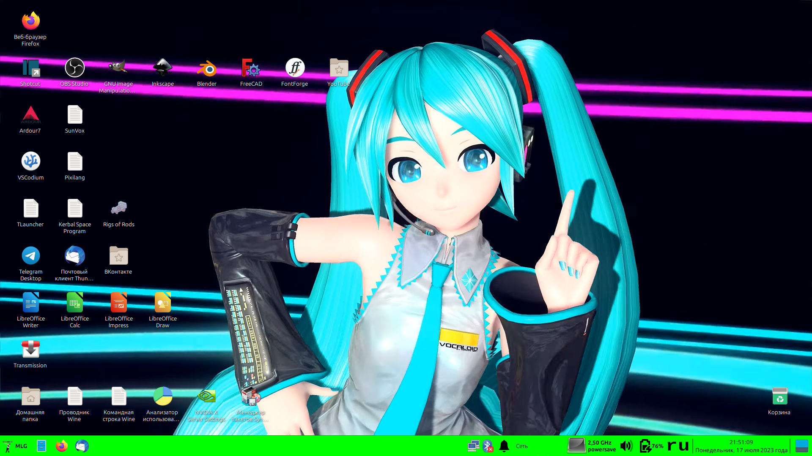
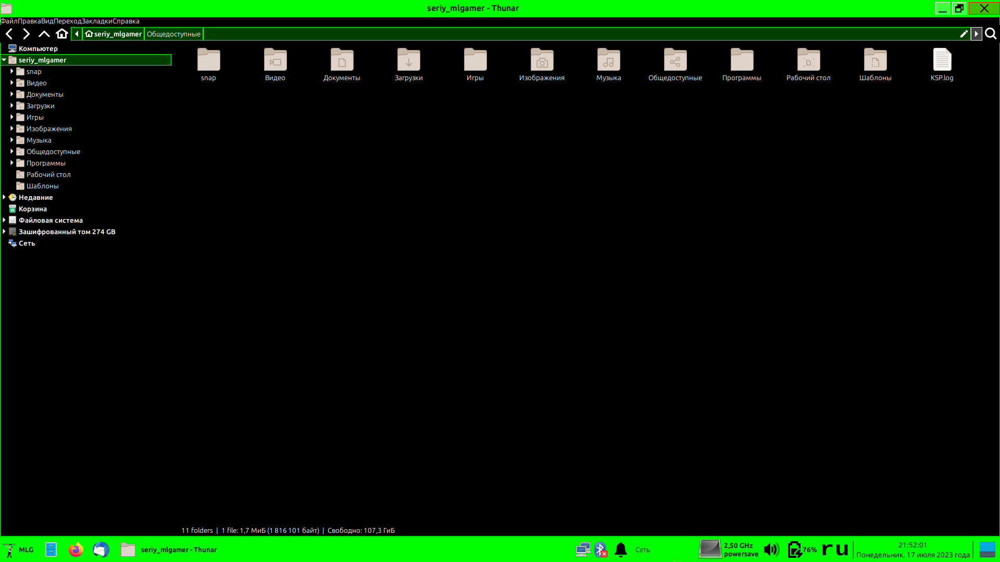

# MLGTK

Мегакрутая тема рабочего стола для GTK/Xfce. Тёмная, высококонтрастная, с сильными зелёными акцентами. Я использую эту тему в своих очень классных MLG-видосах.

Пока мне некогда разрабатывать эту тему. Поэтому исходный код просто вывален вместе со всяким тестовым мусором, а во внешнем виде есть множество разных багов и непроработок. Зато можете использовать её, если вам она понравилась в таком виде.

Можете ещё помочь с вненим видом этой темы, например, чтобы тема была ещё темнее, контрастность была ещё выше, но зелёные акценты сохранялись.

